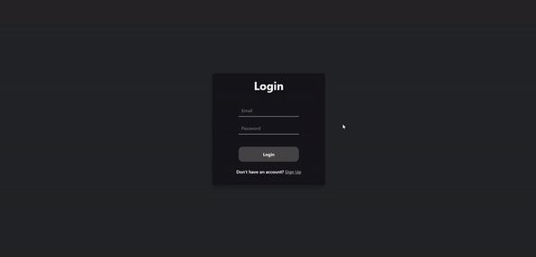
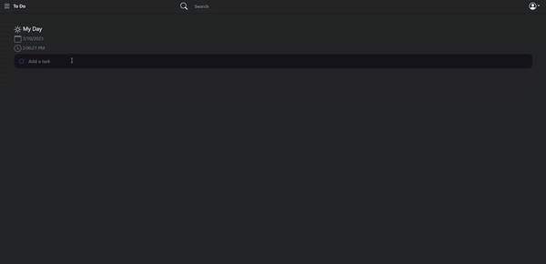
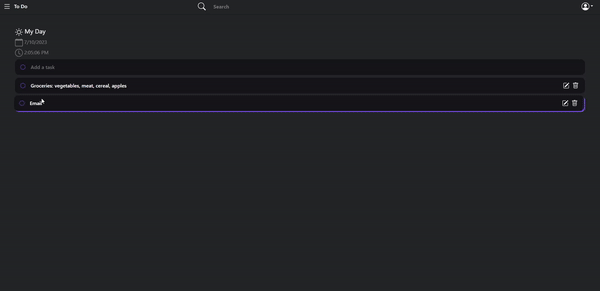
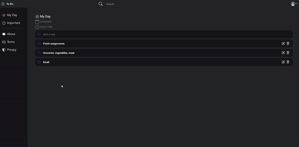
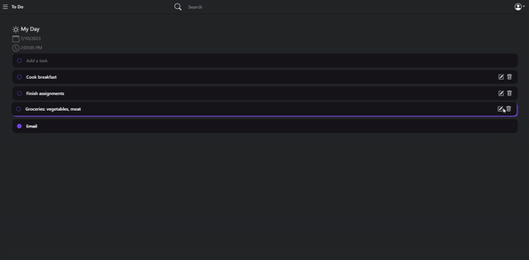

# TODO LIST APP - FULLSTACK DEMO

Fullstack todo list made with Django Rest Framework (REST API) and React.js (FRONTED).

- **Session authentication built from scratch**

- **Client-side routing with secure logout**

- **Django Backend with highly customized models for user/item fetch**

- **Interactive Functions**

- **Editable Items with real-time updates to the backend**

## Built With

- [Django](https://www.djangoproject.com/)
- [React](https://reactjs.org/)
- [Docker](https://www.docker.com/)
- [Node JS](https://nodejs.org/en/)

## Noteable features

- [x] Create, Read, Update, Delete (CRUD) operations
- [x] User authentication
- [x] User registration
- [x] User login
- [x] User logout
- [x] User profile
- [x] Adaptive UI
- [x] Responsive UI
- [x] Dockerized (Frontend)
- [x] REST API
- [x] React.js frontend
- [x] Django backend
- [x] Sqlite database
- [x] Django REST framework (fetch user items/data from backend)
- [x] React Hooks
- [x] React Context API
- [x] React Reducer
- [x] React Router
- [x] React Bootstrap 
- [x] React Testing Library

## Todo
- [ ] Search features
- [ ] Important Items features
- [ ] Sort features
- [ ] Light mode